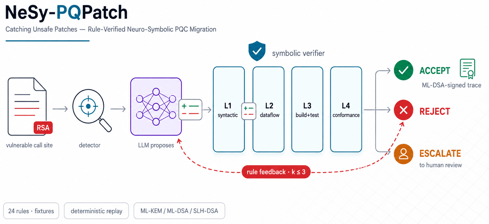

<p align="center">
  
</p>

# NeSy-PQPatch

**Rule-verified neuro-symbolic migration of cryptographic code to post-quantum standards.**

[](https://github.com/sbhakim/nesy-pqpatch/actions/workflows/ci.yml)
[](pyproject.toml)
[](#license)
[](docs/rule-authoring.md)

`pqpatch` couples a language-model patch proposer with a layered symbolic
verifier. The model proposes source-level migrations of quantum-vulnerable
cryptographic call sites (RSA, ECDSA, ECDH) to NIST-standardized primitives
(ML-KEM / FIPS 203, ML-DSA / FIPS 204, SLH-DSA / FIPS 205); the verifier
decides whether each patch is **accepted**, **rejected** with rule-derived
feedback for bounded re-proposal, or **escalated** to a human. Every decision
is recorded as a canonical, hashable trace that can be attested with ML-DSA
signatures.

This repository is the research artifact accompanying the manuscript
*Catching Unsafe Patches: A Rule-Verified Neuro-Symbolic Pipeline for
Post-Quantum Cryptographic Code Migration*.

## Why

The interesting question is not whether a model can write a migration patch,
but whether the pipeline can refuse the wrong one. A patch that **compiles and
passes tests** can still:

- weaken parameters below a policy floor (`ML-KEM-512` where category 3 is required),
- fall back silently to a classical algorithm on any runtime failure,
- reuse one key object across algorithm families,
- discard a verification result, or convert failure into success in a `catch`,
- drop one half of a mandated hybrid construction — or change nothing at all.

These failures are invisible to the industry-default gate (build + test). The
verifier exists to make them unshippable, and the evaluation measures how often
it succeeds — the *residual unsafe-accept rate* — rather than how often the
model is right.

## How it works

The figure above is the system. One pass, left to right:

1. **Detect.** A Semgrep pack plus a usage-class resolver finds
   quantum-vulnerable call sites and classifies each as
   `sign | verify | kem | envelope | config`.
2. **Propose.** A backend LLM receives the site, its extracted context, and
   the migration policy Π, and returns a unified diff plus a structured
   self-report — treated as *claims to check*, never as evidence. Responses
   are content-addressed and cached at the determinism boundary.
3. **Verify.** Four layers run cheapest-first and short-circuit at the first
   violation; all must pass for ACCEPT:
   - **L1 — syntactic** (16 rules): parameter floors and validity, fallback
     shapes, exception discipline, randomness sources, diff scope, and the
     *migration obligation* that rejects no-op patches.
   - **L2 — dataflow/typestate** (8 rules, Tree-sitter def-use): verification
     results must govern control flow, keys must not cross algorithm
     families, constant seeds are followed through variables, hybrid secrets
     must reach a combiner and a KDF.
   - **L3 — build + test**: the patched project compiles and its own test
     suite passes (declarative `build.yaml`, content-anchored diff applier).
   - **L4 — conformance**: round-trip, NIST ACVP vectors, cross-provider
     interop *(interfaces present; implementation pending a PQC runtime)*.
4. **Repair or escalate.** A rejection returns the violated rule's rationale
   to the model for another attempt, at most `k = 3`, then the site escalates
   to human review. Every verdict records exactly which layers ran.

Every rule ships a passing **and** a violating fixture — a rule without both
fails CI — and the rule set is frozen at 24 (tag `rules-v1.0`); the held-out
trap directory is locked by CI from that tag onward.

## Getting started

Requires Python ≥ 3.11, [`semgrep`](https://semgrep.dev), and a JDK on `PATH`.

```bash
pip install -e ".[dev]"
make lint typecheck test   # ruff · mypy · unit + rule-fixture suites
make smoke                 # end-to-end pipeline on the seed corpus, offline
```

Drive one site end-to-end against a local model (free, offline-cachable —
any OpenAI-compatible endpoint works, e.g. Ollama):

```python
from pathlib import Path
from pqpatch.detector.api import detect
from pqpatch.extractor.context import extract_context
from pqpatch.loop import migrate_site
from pqpatch.policy import load_policy
from pqpatch.proposer.backend_c import BackendC
from pqpatch.settings import Settings

root = Path(".")
site = next(s for s in detect(root / "corpus/tier2/file-signing-cli/src",
                              repo_name="file-signing-cli") if s.line == 24)
policy = load_policy(root / "policy/default.yaml")
settings = Settings.load()          # reads PQPATCH_* environment variables
backend = BackendC(settings, model="qwen2.5-coder:7b")

verdict, trace = migrate_site(site, extract_context(site), policy, backend, k=3)
print(verdict.status, verdict.rejected_rule_id)
```

Key environment variables (read only by `settings.py`):

| Variable | Meaning |
|---|---|
| `PQPATCH_OFFLINE=1` | Read-only response cache; a miss is a hard error |
| `PQPATCH_CACHE_DIR` | Content-addressed model-response cache |
| `PQPATCH_RUNS_DIR` | Immutable per-configuration run manifests |
| `PQPATCH_BACKEND_A_API_KEY` / `_BASE_URL` | Hosted OpenAI-compatible backend |
| `PQPATCH_BACKEND_B_API_KEY` | Hosted Anthropic backend |
| `PQPATCH_BACKEND_C_BASE_URL` | Local OpenAI-compatible endpoint |

## Reproducibility

Everything downstream of the model call is deterministic. Model responses are
cached under a digest of *(model, version, prompt bytes, seed)*; offline mode
is read-only by construction, so published numbers regenerate with no API
access, no network, and no GPU. Results are generated **exclusively** from
`runs/` manifests — the table generator refuses to emit a row it cannot back,
and no result number in the repository or the paper is ever typed by hand.

```bash
make reproduce-all      # corpus state · RQ0 detection scoring · manifest tables
make table-detection    # detector precision/recall vs. Tier-2 ground truth
make tables             # capability-funnel + trap summaries, and .tex fragments
```

Ablation arms are named, frozen definitions (`pqpatch.eval.ablations`):
`full`, `remove-l2`, `l3-only`, `no-repair`, `generic-feedback`, `stock-l1`.
Residual unsafe-accept rates additionally require human adjudication of every
accepted trap proposal (`pqpatch.eval.adjudicate`) — the harness refuses to
compute RUA while any acceptance is unlabeled.

## Repository layout

| Path | Contents |
|---|---|
| `src/pqpatch/` | The pipeline: detector, extractor, proposer, verifier, loop, trace, eval |
| `policy/` | Migration policies Π (per-usage-class targets, floors, hybrid obligations) |
| `corpus/` | Evaluation corpora (Tiers 1–3) and the adversarial trap suite |
| `experiments/` | Declarative experiment configurations |
| `containers/` | Pinned build environments for verification layers L3/L4 |
| `docs/` | Architecture decision records and the implementation status ledger |
| `tests/` | Unit, rule-fixture, and integration suites |

## Evaluation design

Three corpus tiers plus an adversarial suite: **Tier 1** extends
CryptoAPI-Bench with reference migrations, and every case also exists in a
semantics-preserving *mutated-surface* variant (`corpus/tier1/mutate.py`) so
memorization shows up as a reported gap rather than an inflated score;
**Tier 2** is a set of purpose-built applications with exact, detector-confirmed
ground truth and real test suites; **Tier 3** samples permissively licensed
projects in the wild. The **trap suite** contains scenarios engineered so the
*plausible* completion is unsafe, with per-trap provenance (taxonomy vs.
external PR/CVE), two-annotator blind labels, a difficulty control separating
what a compiler would already catch, and a held-out subset authored after rule
freeze — the pre-registered primary endpoint.

## Status

A research artifact under active development. `docs/STATUS.md` is the
authoritative ledger of what is implemented versus specified; architecture
decisions, including open ones, live in `docs/ADR/`. **No experimental result
numbers exist in this repository yet, by design** — the manuscript's result
cells remain placeholders until backed by immutable run manifests.

## Citation

```bibtex
@misc{nesy-pqpatch-2026,
  title  = {Catching Unsafe Patches: A Rule-Verified Neuro-Symbolic Pipeline
            for Post-Quantum Cryptographic Code Migration},
  year   = {2026},
  note   = {Manuscript under review; author list to be added on publication},
  url    = {https://github.com/sbhakim/nesy-pqpatch}
}
```

## License

MIT. Corpus entries retain the licenses of their upstream projects, recorded
in `corpus/tier3/manifest.yaml`.
