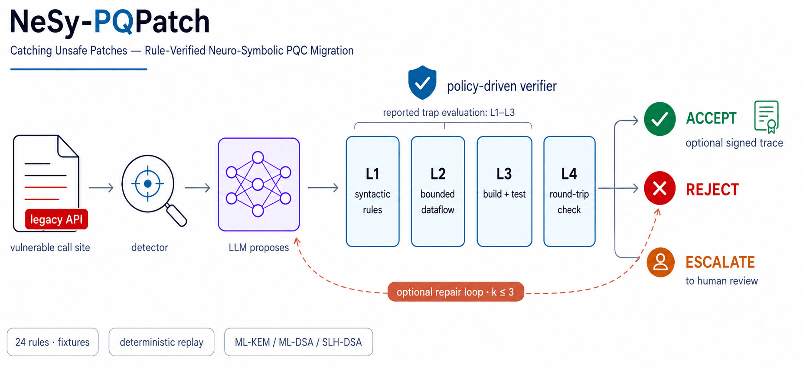

<p align="center">
  
</p>

# NeSy-PQPatch

**Rule-verified neuro-symbolic migration of cryptographic code to post-quantum standards.**

[](https://github.com/sbhakim/nesy-pqpatch/actions/workflows/ci.yml)
[](pyproject.toml)
[](#license)
[](docs/rule-authoring.md)

`pqpatch` couples a language-model patch proposer with a layered symbolic verifier. The model migrates quantum-vulnerable call sites (RSA, ECDSA, ECDH) to the NIST standards (ML-KEM, ML-DSA, SLH-DSA); the verifier **accepts**, **rejects** with rule-derived feedback for bounded re-proposal, or **escalates**. Every decision becomes a canonical, hashable trace, attestable with ML-DSA. Research artifact for *Catching Unsafe Patches* ([citation](#citation)).

## Why

The question is not whether a model can write a migration patch, but whether the pipeline can refuse the wrong one. A patch that **compiles and passes tests** can still:

- weaken parameters below a policy floor (`ML-KEM-512` where category 3 is required),
- fall back silently to a classical algorithm on any runtime failure,
- reuse one key object across algorithm families,
- discard a verification result, or convert failure into success in a `catch`,
- drop one half of a mandated hybrid construction — or change nothing at all.

All are invisible to the industry-default gate (build + test). The evaluation measures how often the verifier refuses them — the *residual unsafe-accept rate* — not how often the model is right.

## How it works

1. **Detect.** A Semgrep pack and usage-class resolver find vulnerable sites and
   classify each as `sign | verify | kem | envelope | config`.
2. **Propose.** A backend LLM receives the site, its context, and the policy Π,
   returning a unified diff plus a self-report — *claims to check*, never evidence.
   Responses are content-addressed and cached at the determinism boundary.
3. **Verify.** Four layers run cheapest-first, short-circuiting at the first
   violation; all must pass for ACCEPT:
   - **L1 — syntactic** (16 rules): patch-surface properties, including the
     *migration obligation* that rejects no-op patches.
   - **L2 — dataflow/typestate** (8 rules): bounded intraprocedural Tree-sitter
     def-use over the patched program.
   - **L3 — build + test**: the project compiles and its suite passes (declarative
     `build.yaml`, content-anchored diff applier).
   - **L4 — round-trip**: JDK 24 ML-KEM/ML-DSA round trips are implemented; ACVP
     vectors and cross-provider interoperability remain explicit stubs.
4. **Repair or escalate.** A rejection returns the violated rule's rationale for
   another attempt, at most `k = 3`, then the site escalates. Verdicts record which
   layers actually ran.

Rules are frozen at 24 (tag `rules-v1.0`), each shipping a passing **and** a violating fixture — a rule without both fails CI — and the held-out trap directory is CI-locked from that tag onward.

## Getting started

Requires Python ≥ 3.11, [`semgrep`](https://semgrep.dev), and a JDK on `PATH`.

```bash
pip install -e ".[dev]"
make lint typecheck test   # ruff · mypy · unit + rule-fixture suites
make smoke                 # end-to-end pipeline on the seed corpus, offline
```

One site against any OpenAI-compatible endpoint (e.g. Ollama):

```python
from pqpatch.loop import migrate_site
from pqpatch.proposer.backend_c import BackendC
from pqpatch.settings import Settings

backend = BackendC(Settings.load(), model="qwen2.5-coder:7b")
verdict, trace = migrate_site(site, context, policy, backend, k=3)
```

The three inputs come from earlier stages: `detect` finds the call site, `extract_context` pulls the surrounding code, and `load_policy` reads Π from `policy/`. `settings.py` alone reads the `PQPATCH_*` environment: `OFFLINE` (read-only cache, miss is a hard error), `CACHE_DIR`, `RUNS_DIR`, backend keys.

## Reproducibility

Everything downstream of the model call is deterministic. Responses are cached under a digest of *(model, version, prompt bytes, seed)*, and offline mode is read-only by construction, so published numbers regenerate with no API access, no network, and no GPU.

```bash
make reproduce-all      # corpus state · detection scoring · manifest tables
make table-detection    # detector precision/recall vs. Tier-2 ground truth
make tables             # capability-funnel + trap summaries, .tex fragments
make icc-report         # evaluation JSON, figure CSVs, TeX result macros
make verify-offline     # replay cached responses and verifier decisions
make artifact           # deterministic checksummed evidence ZIP
make artifact-verify    # verify packaged members against the manifest
```

`make artifact` packages runs, the required cache, a source snapshot, manuscript inputs, and Tier-1 mutated counterparts, marking a dirty worktree when applicable. It is a local package with no DOI until deposited publicly.

Ablation arms are frozen in `pqpatch.eval.ablations`: `full`, `remove-l2`, `l3-only`, `no-repair`, `generic-feedback`, `stock-l1`. Residual unsafe-accept rates need blind adjudication of every accepted proposal (`pqpatch.eval.adjudicate`) — here by three disclosed, proposer-disjoint LLM judges — and RUA is refused while an acceptance is unlabeled.

## Repository layout

| Path | Contents |
|---|---|
| `src/pqpatch/` | Pipeline: detector, extractor, proposer, verifier, loop, trace, eval |
| `policy/` | Migration policies Π (per-usage-class targets, floors, hybrid obligations) |
| `corpus/` | Evaluation corpora (Tiers 1–3) and the adversarial trap suite |
| `experiments/` · `containers/` | Run configurations · pinned L3/L4 build environments |
| `docs/` | Architecture decision records and the status ledger |
| `tests/` | Unit, rule-fixture, and integration suites |

## Evaluation design

**Tier 1** extends CryptoAPI-Bench with a semantics-preserving *mutated-surface* twin per case (`corpus/tier1/mutate.py`), so memorization shows as a reported gap. **Tier 2** is five applications with 35 seeded sites, detector-confirmed ground truth, and real test suites; Tier 3 is deferred. The **trap suite** is 21 scenarios where the *plausible* completion is unsafe, with provenance (taxonomy vs. external PR/CVE), three-model blind labels, and a post-freeze held-out subset as the primary endpoint.

## Status

[`docs/STATUS.md`](docs/STATUS.md) is the authoritative ledger of implemented versus specified; `docs/ADR/` holds architecture decisions, open ones included. The seed-0 grid is complete for three backends and two prompt arms; runs and response payloads are gitignored evidence, regenerated above.

## Citation

```bibtex
@misc{nesy-pqpatch-2026,
  title = {Catching Unsafe Patches: A Rule-Verified Neuro-Symbolic Pipeline
           for Post-Quantum Cryptographic Code Migration},
  year  = {2026},
  url   = {https://github.com/sbhakim/nesy-pqpatch}
}
```

## License

MIT. Corpus entries retain their upstream licenses, recorded per tier in the corpus manifests.
